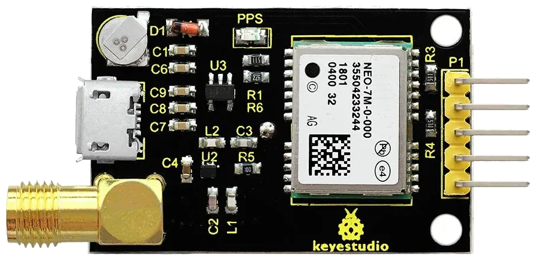
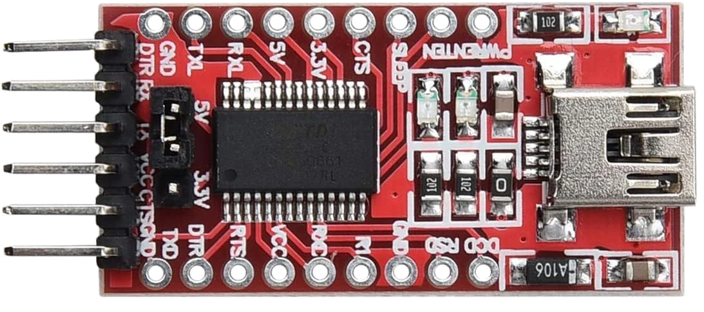
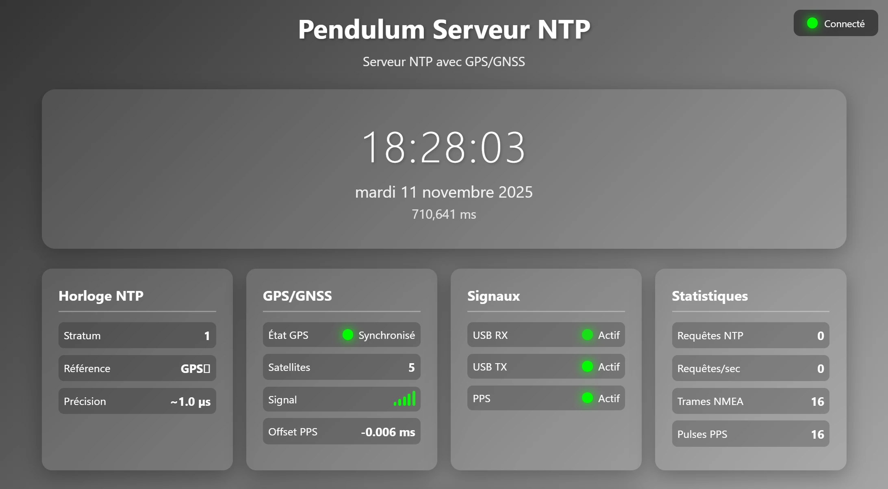
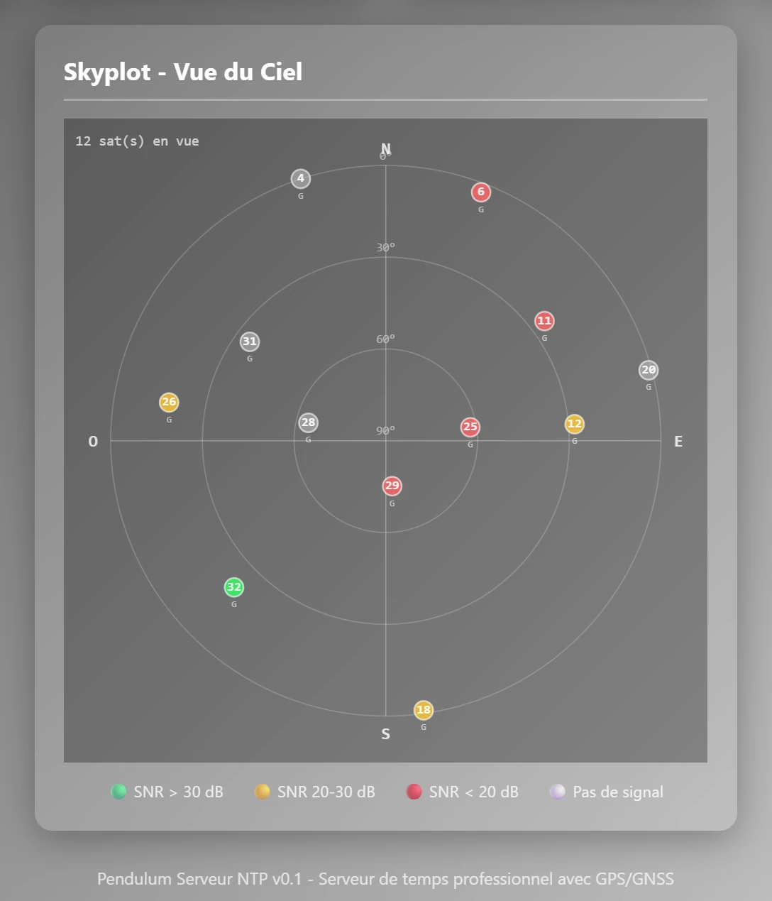

# Pendulum

**Un serveur NTP professionnel avec synchronisation GPS/GNSS en Rust**

[](https://opensource.org/licenses/MIT)
[](https://www.rust-lang.org/)

## Description

Pendulum est un serveur de temps NTP (Network Time Protocol) haute précision qui se synchronise directement sur les horloges atomiques des satellites GPS. Il permet de créer une source de temps primaire (Stratum 1) à faible coût, comparable aux solutions commerciales coûtant plusieurs milliers d'euros.

Le serveur intègre une interface web de monitoring en temps réel et supporte la détection du signal PPS (Pulse Per Second) via le port série pour une précision inférieure à la milliseconde.

## Caractéristiques principales

- **Serveur NTP Stratum 1** : Synchronisation directe sur satellites GPS
- **Haute précision** : Moins de 1 milliseconde avec GPS et PPS
- **Détection PPS** : Signal Pulse Per Second via ligne CTS du port série
- **Interface web** : Dashboard de monitoring avec horloge temps-réel et indicateurs
- **Robustesse** : Reconnexion automatique GPS, fallback vers horloge système
- **Sécurité** : Rate limiting, filtrage IP, validation stricte des paquets
- **Multi-plateforme** : Windows et Linux
- **Configuration flexible** : Fichier TOML avec valeurs par défaut intelligentes
- **Logs structurés** : Traçage détaillé avec niveaux configurables
- **API temps-réel** : WebSocket pour mises à jour continues des statistiques

## Matériel requis

### Module GPS

Le serveur fonctionne avec la plupart des modules GPS NMEA standards : u-blox NEO-7M, u-blox NEO-M9N ou Adafruit Ultimate GPS. Liste non-exhaustive.

### Accessoires

- **Antenne GPS active** : 28 dB gain recommandé
- **Convertisseur USB-série FTDI-232** ou compatible si le module GPS n'a pas d'USB intégré
- **Câbles** : Connecteurs USB et câble d'antenne avec format adapté au module GPS

### Connexion

Pour un montage typique avec module NEO-7M et FTDI-232 :

```
Module GPS NEO-7M      FTDI-232 USB
------------------------------------
USB vers PC       /    USB vers PC
GND               →    GND
TXD               →    RX
PPS               →    CTS (optionnel, mais beaucoup plus précis)
```

L'antenne GPS doit être positionnée avec une vue dégagée du ciel (fenêtre, toit) afin qu'elle puisse recevoir les signaux satellites.

### Montage électronique
Exemple, on a ici un module GPS NEO-7M de chez KeyeStudio


Le FTDI-232 permet l'interconnexion du NEO-7M sur un PC via USB


Voici le montage complet avec le détail du câblage


### Interface Web de monitoring



## Installation

### Prérequis

- Rust 1.70 ou supérieur : https://rust-lang.org/fr/tools/install/
- Droits administrateur : nécessaires pour utiliser le port NTP 123

### Compilation

```bash
# Cloner le dépôt
git clone https://github.com/Le-Stef/pendulum.git
cd pendulum

# Compiler en mode release (optimisé)
cargo build --release

# L'exécutable se trouve dans target/release/
```

### Installation système (optionnel)

**Linux** :
```bash
sudo cp target/release/pendulum /usr/local/bin/
sudo setcap cap_sys_time,cap_sys_nice=+ep /usr/local/bin/pendulum
```

**Windows** :
Copier `target\release\pendulum.exe` dans un répertoire de votre choix et créer un raccourci avec droits administrateur.

## Configuration

### Première exécution

Au premier lancement, Pendulum crée automatiquement un fichier `config.toml` avec les paramètres par défaut :

```bash
# Linux
sudo ./pendulum

# Windows (en tant qu'administrateur)
.\pendulum.exe
```

### Fichier config.toml

Exemple de configuration complète :

```toml
[server]
# Adresse d'écoute du serveur NTP
bind_address = "0.0.0.0:123"

# Stratum 1 = source primaire (GPS)
stratum = 1

# Précision : 2^-20 ≈ 1 microseconde
precision = -20

# Intervalle de polling (6 = 64 secondes)
poll_interval = 6

[clock]
# Source d'horloge : "system" ou "gps"
source = "gps"

[clock.gps]
# Activer/désactiver le module GPS
enabled = true

# Port série (Windows: "COMx", Linux: "/dev/ttyUSBx" ou "/dev/ttyAMAx")
serial_port = "COM9"

# Vitesse de communication (9600 pour NMEA standard)
baud_rate = 9600

# Timeout : fallback vers horloge système après X secondes sans GPS
sync_timeout = 30

# Nombre minimum de satellites pour considérer la synchronisation valide
min_satellites = 4

# Activer la détection du signal PPS via ligne CTS du port série
pps_enabled = true

# Pin GPIO pour PPS kernel Linux (Raspberry Pi uniquement)
pps_gpio_pin = 18

[security]
# Activer la limitation du taux de requêtes
enable_rate_limiting = true

# Nombre maximum de requêtes par seconde
max_requests_per_second = 100

# Liste blanche d'adresses IP (vide = toutes autorisées)
ip_whitelist = []

# Liste noire d'adresses IP
ip_blacklist = []

[logging]
# Niveau de log : "trace", "debug", "info", "warn", "error"
level = "info"

# Enregistrer les requêtes NTP
log_requests = true

# Fichier de log (relatif au répertoire de travail)
log_file = "pendulum.log"

[webserver]
# Port du serveur web (interface de monitoring)
port = 8080

# Adresse d'écoute du serveur web
bind_address = "0.0.0.0"
```

### Configuration du port série

**Identifier le port série** :

- **Windows** : Gestionnaire de périphériques > Ports COM > noter le numéro (ex: COM9)
- **Linux** : `ls /dev/ttyUSB*` ou `ls /dev/ttyAMA*`

**Permissions Linux** :
```bash
# Ajouter l'utilisateur au groupe dialout
sudo usermod -a -G dialout $USER

# Se déconnecter puis reconnecter pour appliquer
```

## Utilisation

### Démarrage du serveur

**Linux** :
```bash
sudo ./target/release/pendulum

# Ou avec un fichier de config personnalisé
sudo ./target/release/pendulum /chemin/vers/config.toml
```

**Windows** (en tant qu'administrateur) :
```cmd
.\target\release\pendulum.exe

# Ou avec un fichier de config personnalisé
.\target\release\pendulum.exe C:\chemin\vers\config.toml
```

### Logs de démarrage

Avec GPS connecté et fonctionnel :
```
INFO  Pendulum NTP Server v0.1.0
INFO  Professional GPS-synchronized NTP server
INFO  Configuration:
INFO    Bind address: 0.0.0.0:123
INFO    Clock source: gps
INFO  Using GPS clock
INFO    Serial port: COM9
INFO    PPS via CTS: true
INFO  Opening GPS serial port: COM9
INFO  GPS serial port opened successfully
DEBUG GPS time synchronized: 3900123456 seconds, 4 satellites
DEBUG PPS pulse detected (#1) - interval: 1.000023s
INFO  Clock information:
INFO    Stratum: 1
INFO    Reference ID: GPS
INFO  Starting NTP server...
INFO  NTP server listening on 0.0.0.0:123
INFO  Starting web server on 0.0.0.0:8080
```

### Interface web

Ouvrir un navigateur à l'adresse : **http://localhost:8080** (par défaut, configurable dans `config.toml`)

L'interface affiche :

- **Horloge précise en temps réel** avec date et millisecondes
- **Indicateurs** :
  - Statut GPS (vert = synchronisé)
  - Signal PPS (clignote à chaque seconde)
  - Activité USB RX/TX
- **Statistiques NTP** :
  - Requêtes reçues, traitées, rejetées
  - Erreurs
- **Informations système** :
  - Stratum
  - Précision
  - Reference ID
  - Uptime

L'interface se met à jour en temps réel via WebSocket sans rechargement de page.

*[Les captures d'écran de l'interface seront ajoutées ici]*

### Test du serveur NTP

**Windows** :
```cmd
# Test simple avec affichage de l'offset
w32tm /stripchart /computer:127.0.0.1

# Résultat attendu avec GPS :
# 09:21:17, d:+00.0000023s o:+00.0000012s  [* |  ]
```

**Linux** :
```bash
# Test avec ntpdate
ntpdate -q 127.0.0.1

# Résultat attendu :
# server 127.0.0.1, stratum 1, offset 0.000001, delay 0.00012

# Test avec chrony
chronyc sources
chronyc tracking
```

### Configurer les clients

**Windows** :
```cmd
# Configurer le serveur NTP
w32tm /config /manualpeerlist:"192.168.1.100" /syncfromflags:manual /update

# Forcer la synchronisation
w32tm /resync

# Vérifier la configuration
w32tm /query /status
```

**Linux (systemd-timesyncd)** :
```bash
# Éditer /etc/systemd/timesyncd.conf
[Time]
NTP=192.168.1.100
FallbackNTP=pool.ntp.org

# Redémarrer le service
sudo systemctl restart systemd-timesyncd
sudo timedatectl status
```

**Linux (chrony)** :
```bash
# Éditer /etc/chrony/chrony.conf
server 192.168.1.100 iburst prefer

# Redémarrer chrony
sudo systemctl restart chronyd
```

## Dépannage

### Le GPS ne se connecte pas

```
ERROR GPS reader error: Access denied (os error 5)
```

**Solutions** :
- Vérifier que le port série est correct dans config.toml
- Windows : Fermer tout programme utilisant le port COM (Arduino IDE, PuTTY, etc.)
- Linux : Vérifier les permissions (`sudo chmod 666 /dev/ttyUSB0`)
- Vérifier que le module GPS est bien alimenté

### Pas de signal PPS

Le GPS se synchronise mais aucun message "PPS pulse detected" n'apparaît.

**Solutions** :
- Vérifier que `pps_enabled = true` dans config.toml
- Vérifier le câblage : la ligne PPS du GPS doit être connectée à CTS du FTDI
- Certains modules GPS n'émettent le PPS qu'après acquisition du fix (attendre 2-5 minutes)
- Tester avec un multimètre : le signal PPS fait 3.3V pendant 100ms chaque seconde

### Précision insuffisante

L'offset mesuré est supérieur à 5 millisecondes.

**Solutions** :
- Vérifier le nombre de satellites (minimum 4, idéalement 8+)
- Attendre que le GPS ait un bon fix (2-5 minutes après démarrage)
- Améliorer la position de l'antenne (vue dégagée du ciel)
- Activer le PPS si disponible
- Vérifier la charge CPU du système

### Le serveur ne démarre pas

```
ERROR Failed to bind UDP socket: Address already in use
```

**Solution** : Un autre serveur NTP est déjà actif sur le port 123. Désactiver le service système :

**Windows** :
```cmd
net stop w32time
sc config w32time start= disabled
```

**Linux** :
```bash
sudo systemctl stop systemd-timesyncd
sudo systemctl disable systemd-timesyncd
```

## Architecture technique

### Structure du projet

```
pendulum/
├── src/
│   ├── main.rs           # Point d'entrée
│   ├── clock.rs          # Abstraction horloge (System, GPS)
│   ├── packet.rs         # Structure paquet NTP (RFC 5905)
│   ├── server.rs         # Serveur NTP principal
│   ├── gps_reader.rs     # Lecture port série GPS et détection PPS
│   ├── gps_nmea.rs       # Parsing NMEA et documentation GPS
│   ├── security.rs       # Rate limiting et validation
│   ├── config.rs         # Configuration TOML
│   ├── stats.rs          # Statistiques temps-réel
│   └── web_server.rs     # Serveur web et API WebSocket
├── web/
│   └── index.html        # Interface web de monitoring
├── config.toml           # Configuration (généré automatiquement)
└── Cargo.toml            # Dépendances Rust
```

### Flux de données

```
Satellites GPS (horloges atomiques)
         ↓
Module GPS/GNSS
    ↓           ↓
Port série    Signal PPS
(NMEA)        (via CTS)
    ↓           ↓
GpsReader (thread séparé)
         ↓
   GpsNmeaClock
         ↓
    NtpServer ────→ Clients NTP (port 123)
         ↓
    WebServer ────→ Interface web (port 8080)
```

### Caractéristiques de l'implémentation

- **Thread GPS séparé** : Le serveur NTP n'est jamais bloqué par le GPS
- **Reconnexion automatique** : Exponential backoff (5s → 60s)
- **Fallback intelligent** : Utilise l'horloge système si GPS indisponible
- **Aucun panic** : Toutes les erreurs gérées avec Result<T, E>

### Précision attendue

| Configuration | Précision | Stratum |
|---------------|-----------|---------|
| Horloge système seule | 10-100 µs | 16 |
| GPS sans PPS | 10-50 ms | 1 |
| GPS + PPS via CTS | < 1 ms | 1 |
| GPS + PPS kernel Linux | < 10 µs | 1 |

## Déploiement en production

### Service systemd (Linux)

Créer `/etc/systemd/system/pendulum.service` :

```ini
[Unit]
Description=Pendulum NTP Server
After=network.target

[Service]
Type=simple
User=root
WorkingDirectory=/opt/pendulum
ExecStart=/opt/pendulum/pendulum /etc/pendulum/config.toml
Restart=on-failure
RestartSec=5s

# Sécurité
PrivateTmp=true
NoNewPrivileges=true
ProtectSystem=strict
ProtectHome=true
ReadWritePaths=/var/log/pendulum

[Install]
WantedBy=multi-user.target
```

Activer :
```bash
sudo systemctl daemon-reload
sudo systemctl enable pendulum
sudo systemctl start pendulum
sudo systemctl status pendulum
```

## Performance

Résultats typiques sur Raspberry Pi 4 avec GPS NEO-7M :

- **Latence** : < 500 µs (temps de traitement)
- **Throughput** : > 10,000 requêtes/sec
- **Mémoire** : ~5 MB RSS
- **CPU** : < 1% en idle, ~15% à 10k req/s
- **Précision** : < 1 ms avec PPS via CTS

## Licence

Ce projet est distribué sous licence MIT. Voir le fichier LICENSE pour plus de détails.

## Ressources

### Standards
- [RFC 5905 - NTPv4](https://tools.ietf.org/html/rfc5905)
- [NMEA 0183](http://www.nmea.org/)

### Documentation
- [Linux PPS API](https://www.kernel.org/doc/html/latest/driver-api/pps.html)
- [Raspberry Pi NTP Setup](https://www.satsignal.eu/ntp/Raspberry-Pi-NTP.html)
- [chrony documentation](https://chrony.tuxfamily.org/documentation.html)

### Outils de test
- `ntpdate` : Test simple
- `ntpq -p` : Monitoring NTP
- `chronyc tracking` : Suivi précision avec chrony
- `w32tm` : Client NTP Windows
